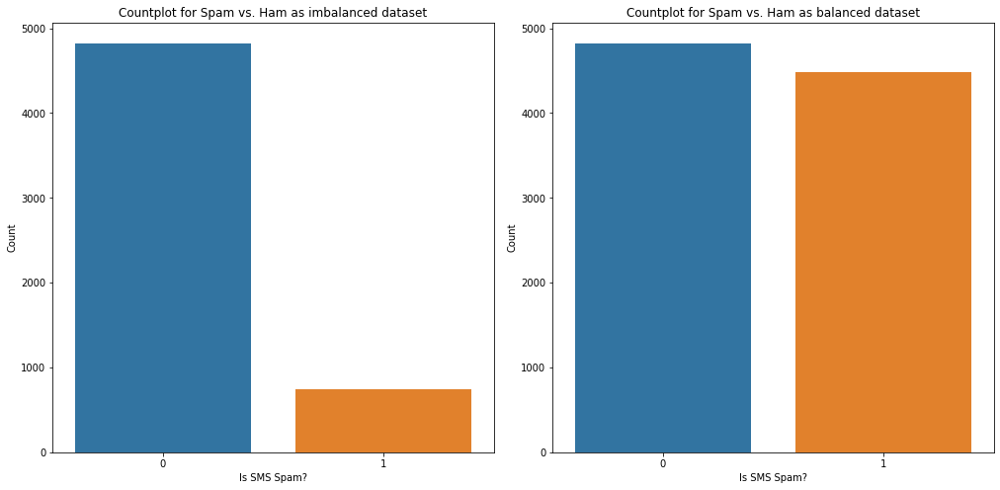
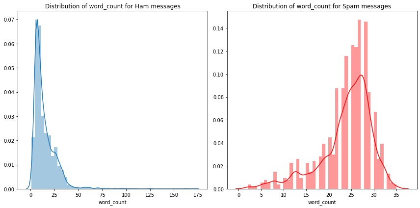
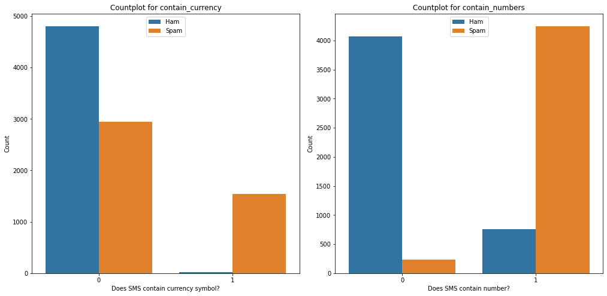
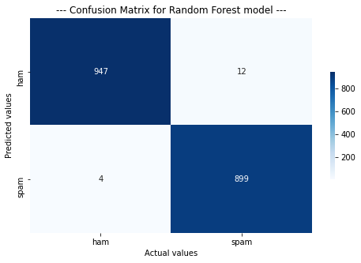

## Feature Engineering
• Handling imbalanced dataset using Oversampling 
 
• **Creating new features** from existing features e.g. **word_count, contains_currency_symbol, contains_numbers**, etc. 
 

## Model Building and Evaluation
**Metric: F1-Score** 
• Multinomial Naive Bayes: 0.943 
• Decision Tree: 0.98 
• **Random Forest: 0.994** 
• Voting (Decision Tree + Multinomial Naive Bayes): 0.98 
 
_**Note: Evaluation scores are obtained using cross validation.**_

